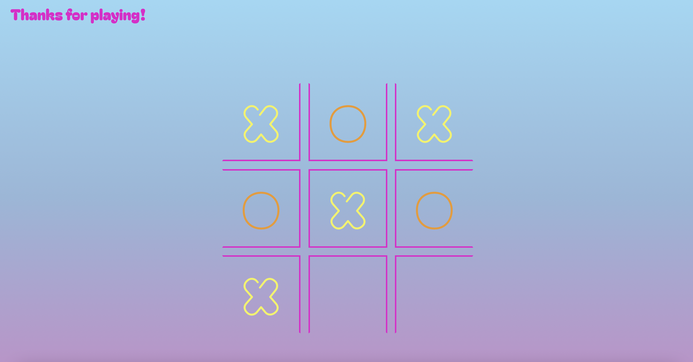

# Tic-Tac-Toe Game

[Live Site](https://monikachris.github.io/tic-tac-toe/)

## About

This tic-tac-toe game is implemented with JavaScript factory functions, using closures to encapsulate and protect private data. For a modular design and separation of concerns, four functions control the game logic and display: Cell, Gameboard, GameController, ScreenController. This achieves loose coupling of components.

Cell: Holds the state (X, O, or empty) for an individual cell. Uses closure to encapsulate its state, and provides methods to access or modify this state.

GameBoard: Initializes a grid of Cell objects to serve as a gameboard. Manages the state of the gameboard object and exposes methods for accessing and updating it.

GameController: Handles game logic and interacts with a GameBoard object to store the game state. Manages game flow, processes moves, and checks for win/tie conditions.

ScreenController: Passes user inputs to a GameController object and displays outputs. Handles all DOM manipulations to separate display from game logic.

## Live Site Image

## Technologies

Vanilla JavaScript, HTML, CSS
